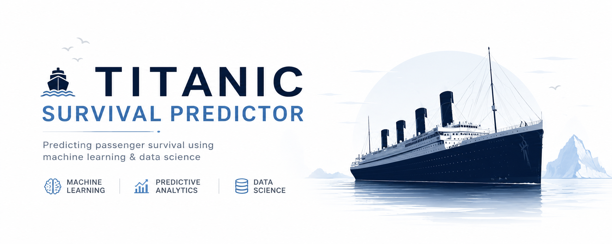
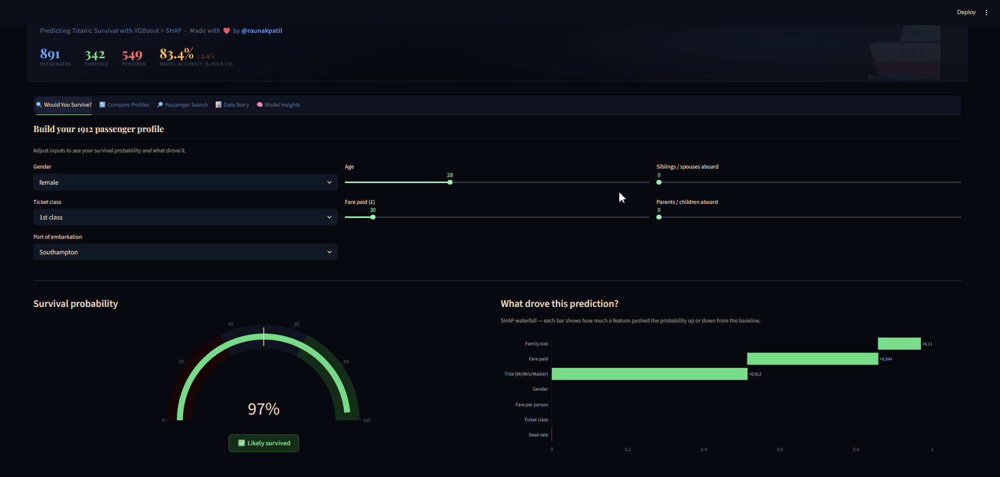
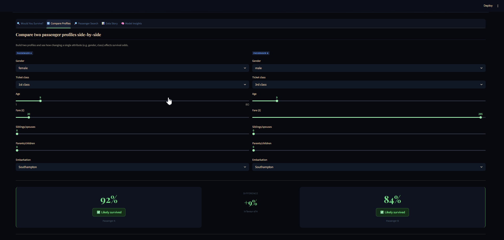
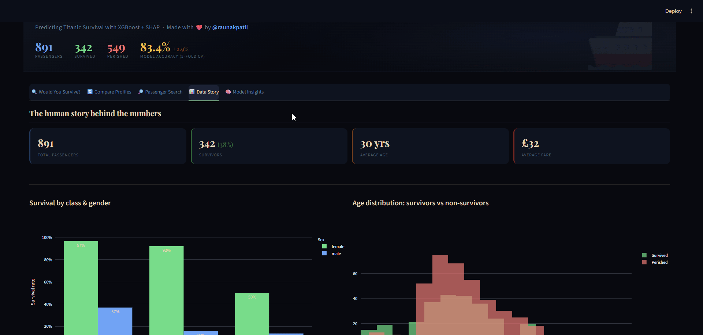
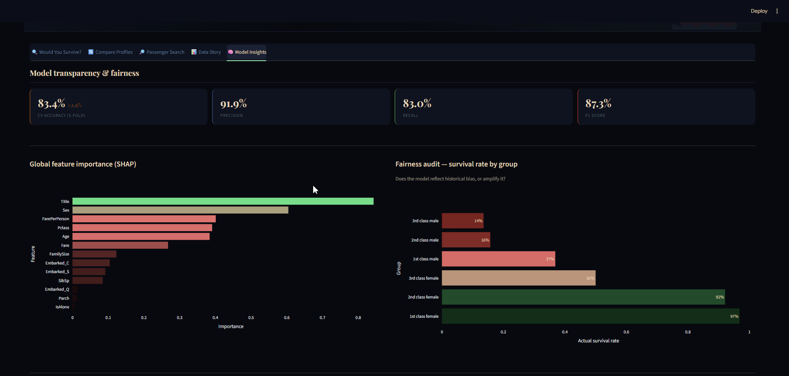

# 🚢 Titanic Survival Predictor



> An interactive ML explainability dashboard — XGBoost + SHAP + Streamlit

[](https://your-app.streamlit.app)
[](https://python.org)
[](https://xgboost.readthedocs.io)
[](https://shap.readthedocs.io)

---

> **Most Titanic projects stop at "I got 80% accuracy."**
> This one asks: _what actually drove each prediction, and what does that tell us about fairness, bias, and the human cost of class inequality?_

---

## 📸 Demo

### 🔍 Would You Survive?


### 🔄 Compare Profiles


### 🔎 Passenger Search


### 📊 Data Story


### 🧠 Model Insights


---

## ✨ Features

| Tab | What you can do |
|-----|----------------|
| 🔍 **Would You Survive?** | Build a passenger profile → get survival probability + SHAP waterfall + historical twin + 100-passenger simulator |
| 🔄 **Compare Profiles** | Two profiles side-by-side with a delta readout and feature contribution comparison |
| 🔎 **Passenger Search** | Search any of the 891 passengers by name, see actual fate vs model prediction |
| 📊 **Data Story** | Survival by class/gender/age/fare/family size — the human story |
| 🧠 **Model Insights** | Cross-validated accuracy, SHAP importance, fairness audit, confusion matrix, model card |

---

## 🛠 Tech stack

| Layer | Technology |
|-------|-----------|
| Model | XGBoost Classifier |
| Explainability | SHAP TreeExplainer (global + per-passenger waterfall) |
| Evaluation | 5-fold cross-validation (not just training accuracy) |
| Visualisation | Plotly (gauge, waterfall, histogram, box, heatmap) |
| App | Streamlit |
| Data | [Kaggle Titanic competition](https://www.kaggle.com/competitions/titanic) |

---

## 📁 Project structure

```
titanic-survival-explorer/
│
├── app.py              # Streamlit app (5 tabs)
├── model.py            # XGBoost training, SHAP prediction, simulator
├── data_utils.py       # Feature engineering, twin lookup, passenger search
├── requirements.txt    # Pinned dependencies
├── .gitignore
│
└── data/               # NOT committed — download from Kaggle
    ├── train.csv
    └── test.csv
```

---

## 🚀 Running locally

```bash
# 1. Clone
git clone https://github.com/raunakpatil/titanic-survival-explorer.git
cd titanic-survival-explorer

# 2. Install pinned dependencies
pip install -r requirements.txt

# 3. Download Kaggle data
#    → https://www.kaggle.com/competitions/titanic/data
#    Place train.csv and test.csv in data/

# 4. Run
streamlit run app.py
```

---

## ☁️ Deploy to Streamlit Cloud (free, ~2 min)

1. Push this repo to GitHub
2. Go to [share.streamlit.io](https://share.streamlit.io) → **New app**
3. Select your repo → point to `app.py`
4. Add `train.csv` and `test.csv` to a `data/` folder in the repo _(or use Streamlit secrets + a remote data source)_
5. Click **Deploy** — you get a public URL immediately

---

## 📊 Key findings

- **Gender was the single most predictive feature** — female passengers were ~3.7× more likely to survive (avg SHAP: +0.35)
- **1st class had 2.5× the survival rate of 3rd class** — "women and children first" applied most strictly to upper decks
- **Solo travellers fared worse** than passengers in small families (2–4 people)
- **Children under 12 survived at higher rates** regardless of class — age mattered most at the extremes

---

## 🃏 Model card

| | |
|---|---|
| **Model** | XGBoost Classifier |
| **Training data** | Titanic train.csv · 891 passengers |
| **Features** | Sex, Pclass, Age, Fare, SibSp, Parch, Embarked, FamilySize, IsAlone, Title, FarePerPerson |
| **CV Accuracy** | ~83% ± 2% (5-fold cross-validation) |
| **Precision / Recall** | ~82% / ~80% |
| **Known bias** | Class and gender are strong predictors — reflects documented historical inequality, not a model flaw |
| **Intended use** | Educational and portfolio use only |
| **Not intended for** | Any real-world decision-making |

---

## 📄 License

MIT
